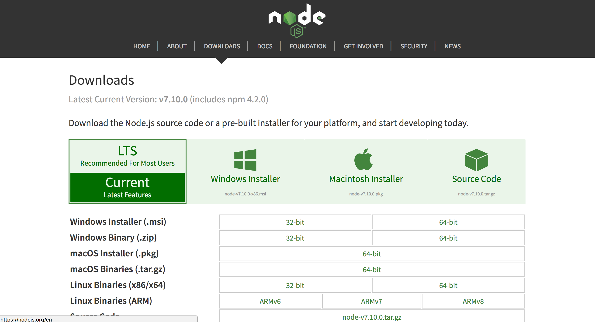
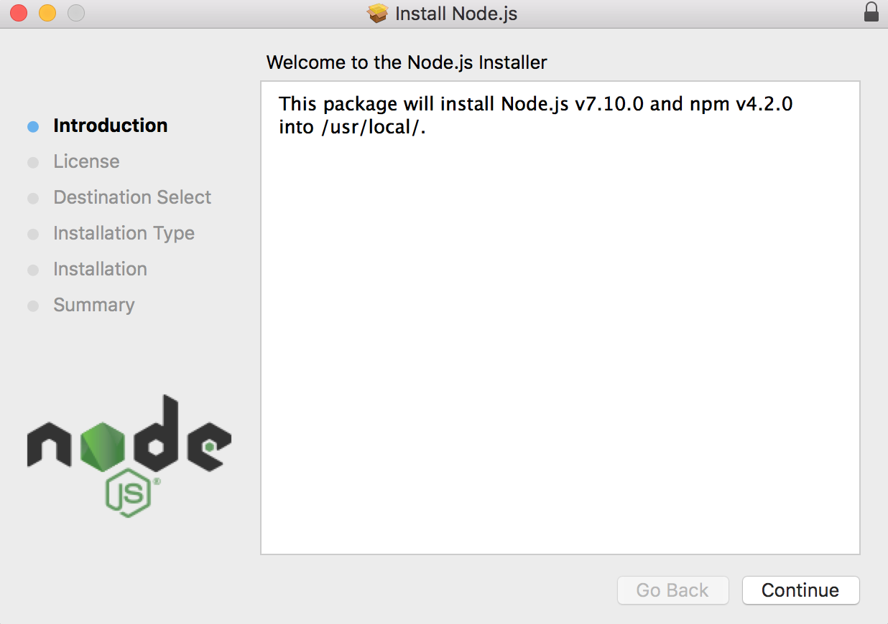
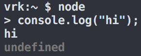
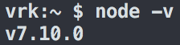


../

This tutorial has sections covering the following topics:     

* TOC
{:toc}


<section class="part" markdown="1">

## Installing Node.js

> Note: There are two main Node.js release lines:
> - "LTS" (Long Term Support) — stable and recommended for most learners and production projects.
> - "Current" — newest features; useful for experimenting.
>
> For class work and production, we strongly recommend installing the latest LTS release (or using a version manager so you can switch between releases easily).

### Recommended: Install a version manager (nvm)
{:.no_toc}

Using a version manager is the easiest and safest way to install Node.js. It avoids permission problems and lets you switch Node versions per-project.

- Install nvm (macOS / Linux):

```bash
# Install or update nvm (from the official nvm repository)
# NOTE: Check https://github.com/nvm-sh/nvm for the latest install instructions.
curl -fsSL https://raw.githubusercontent.com/nvm-sh/nvm/master/install.sh | bash

# Restart your terminal or source your shell profile, for example:
source ~/.bashrc   # or ~/.zshrc, ~/.profile depending on your shell

# Install the latest LTS (recommended) and set it as default
nvm install --lts
nvm use --lts
nvm alias default lts/*
```

- On Windows: use nvm-windows (a separate project): https://github.com/coreybutler/nvm-windows
  - nvm-windows has a different installer and command set; follow that project's instructions.

Examples:

```bash
nvm ls               # list installed Node versions
nvm install 20       # install Node.js v20.x (replace 20 with any major version)
nvm use 20
node -v
```

Using nvm avoids modifying system directories and makes it trivial to try different Node versions.

### Install from the official website (macOS / Windows)
{:.no_toc}

If you prefer a GUI installer, download Node from https://nodejs.org/en/download/:

- Download the **LTS** installer (recommended for most users).
- macOS: a .pkg installer
- Windows: an .msi installer
- Linux: tarballs and distribution packages are available

After installing, verify:

```bash
node -v   # should show the installed version, e.g. vXX.YY.Z
npm -v    # npm is bundled with Node and should be available
npx --version
```

### Install with Homebrew (macOS)
{:.no_toc}

If you use Homebrew:

```bash
# Install Homebrew if you don't have it: https://brew.sh/
brew update
brew install node    # installs the latest stable Node; you can also install node@<major> if needed
```

On Apple Silicon Macs Homebrew installs under /opt/homebrew; ensure your PATH includes the Homebrew bin directory. Using nvm is still preferred for per-user version management.

### Install on Linux (apt, dnf, pacman)
{:.no_toc}

Use your distro packages or NodeSource. Example for Debian/Ubuntu using NodeSource (replace the major version if you need a specific one):

```bash
# Example: install Node.js 20.x via NodeSource (replace with desired major version)
curl -fsSL https://deb.nodesource.com/setup_20.x | sudo -E bash -
sudo apt-get install -y nodejs
```

Alternatively, use nvm for per-user installs (recommended for development machines).

### 1) Download Installer (if using installer)
{:.no_toc}

* Visit https://nodejs.org/en/download/ and choose the LTS installer for your operating system.
* On macOS you will get a .pkg; on Windows an .msi.



### 2) Follow GUI installation instructions
{:.no_toc}

* Open the downloaded installer and follow the prompts.
* On macOS you may need to enter your password to allow system changes.
* If you run into permission or PATH issues, consider switching to nvm instead of a system installer.



### 3) Testing Node.js
{:.no_toc}

* Open Terminal (macOS / Linux) or PowerShell / Command Prompt (Windows).
* Type `node` and press Enter to open the interactive REPL.
* Try a simple expression, e.g. `console.log('hello')` or `1 + 2`.
* Press Ctrl-C twice to exit the REPL.
* Run `node -v` to confirm the installed version.





### 4) Testing `npm` and `npx`
{:.no_toc}

npm (Node Package Manager) is bundled with Node. npx allows running package binaries without installing them globally.

```bash
npm -v
npx --version
```

Try a small example:

```bash
mkdir mynode && cd mynode
npm init -y
npm install lodash
node -e "console.log(require('lodash').VERSION)"
```

### 5) OPTIONAL: Install `http-server`
{:.no_toc}

http-server is a simple static file server useful for quick testing.

```bash
npm install -g http-server
# Run in any directory to serve files:
http-server
```

Visit the address shown in your browser (e.g. http://127.0.0.1:8080).

</section>

<section class="part" markdown="1">
## Basic Command Line Skills

We are not going to be teaching command line skills in class, as it was considered prerequisite knowledge for CS193x. However, we will provide some basic help below.

Skip this section if you are already familiar with command line interfaces.

### Concepts
{:.no_toc}

* The command line is just another way of controlling your computer.
* It is a _textual_ interface. The icons that you commonly interact with (i.e. click on) are parts of a _graphical_ user interface. They can accomplish many of the same things!
* For most development work, a CLI (command line interface) is much more expedient because it allows you to work more fluidly with code and run code/commands that do not have a graphical user interfac[...] 
* However, you have way more control over what you can see and do. This is really powerful, but with great power comes great responsibility. You don't need to be scared of the command line, but you do[...] 

### Some basic commands
{:.no_toc}

Note:
* The `$` character signals the beginning of a shell prompt. The _shell_ is the execution environment for commands. You can think of it as the "session".
* Lines starting with `#` are comments. These commands are mostly Mac-centric, but most will work on Linux and possibly Windows. (You should check before running.)
* Lines starting with `>` are the _shell's_ outputs.


```bash
# Clears visual display, does not delete any files.
$ clear
```

```bash
# Print the current working directory -- aka "where am I?"
$ pwd
> /Users/someplace/somewhere/folder/code
```

```bash
# Change directory -- aka "move from one folder to another"
# After typing `cd ` you can hit Tab once or twice and it will autocomplete or
# list the possible folders you can visit
$ cd   
# The dot-dot stands for the parent directory. It means to go one directory "up."
$ cd ..
# You can navigate multiple folders in one go:
$ cd somefolder/place/code/ 
```

```bash
# List the files in a directory -- aka "whats in this folder?"
$ ls
> Somefolder Code Photos
> Dogpictures GIFs CS193X
> rootkit  script.py
>
$ ls *.py  # you can use regular expressions!
> script.py
```

```bash
# Makes a new directory -- aka "makes a new folder"
$ mkdir hw
$ ls
> Code Random  hw
$ cd hw
$ pwd
> ~/User/somefolder/hw
```

```bash
# Opens the GUI file explorer -- aka "where is this in Finder?"
# Opens the current directory in Finder (the dot is the current directory)
$ open .
# Opens the directory "someFolder" in Finder
$ open someFolder
# Uses the system default program to open this file
$ open somefile.py
```

### A note on deleting files
{:.no_toc}

* If you are a first-time command line user, I recommend using the `open` command to open the directory you want to work in, and then use Finder to delete the files you want, as you would normally.

* You also can use the `rm` command, but if you're new, I would recommend getting familiar with everything first and then working with `rm`.

Further References:

* https://practicalunix.org/ or (CS1U: Practical Unix)
* Unix manpages: run `man [command]` to see the complete, but verbose and sometimes hard to understand, documentation for that command.
</section>

<section class="part" markdown="1">

## Troubleshooting

This section contains information on how to debug problems with installing Node.

### Common issues and fixes
{:.no_toc}

- Permission errors when installing global npm packages:
  - Avoid using sudo with npm. If you installed Node system-wide and you see EACCES errors, either reinstall using a version manager (nvm) or follow the official npm docs to change npm's default directory: https://docs.npmjs.com/resolving-eacces-permissions-errors-when-installing-packages-globally

- PATH problems after installing:
  - Ensure the directory containing `node` and `npm` is in your PATH. If you installed with nvm, make sure your shell profile (e.g. ~/.bashrc or ~/.zshrc) loads nvm (the nvm installer adds the necessary lines).

- macOS Apple Silicon (M1/M2) issues:
  - Homebrew installs to /opt/homebrew on Apple Silicon. Ensure /opt/homebrew/bin is in your PATH.
  - Consider using nvm to avoid mixing system and Homebrew installations.

- If a GUI installer fails:
  - Check the installer log and the macOS Console for error messages.
  - Prefer nvm or Homebrew if you need an easier developer experience.

> Note: Older guides instructed disabling System Integrity Protection (SIP) on macOS. In almost all cases this is unnecessary and reduces security; do not disable SIP unless you fully understand the risks and have a specific documented need.

</section>
<section class="part" markdown="1">

## Credits
{:.no_toc}

This tutorial was written by  TA Zach Maurer and updated by Ahmed Alharthi. Thanks, Zach!
